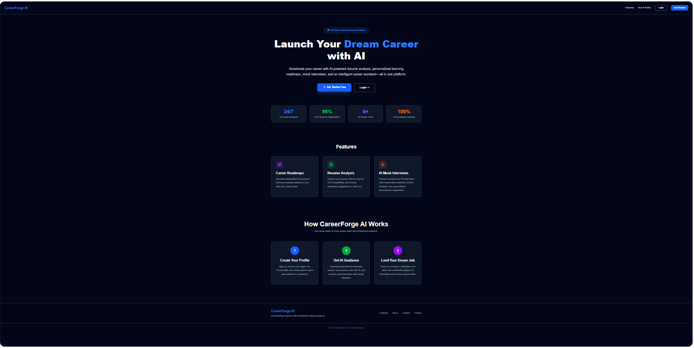
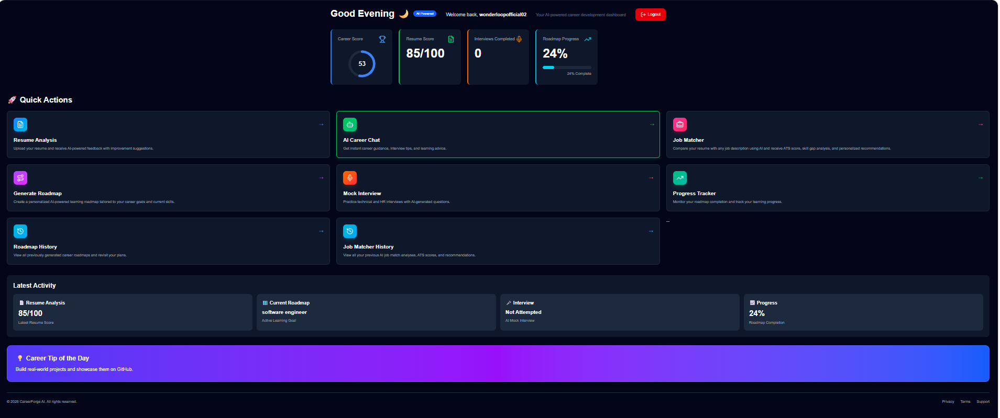
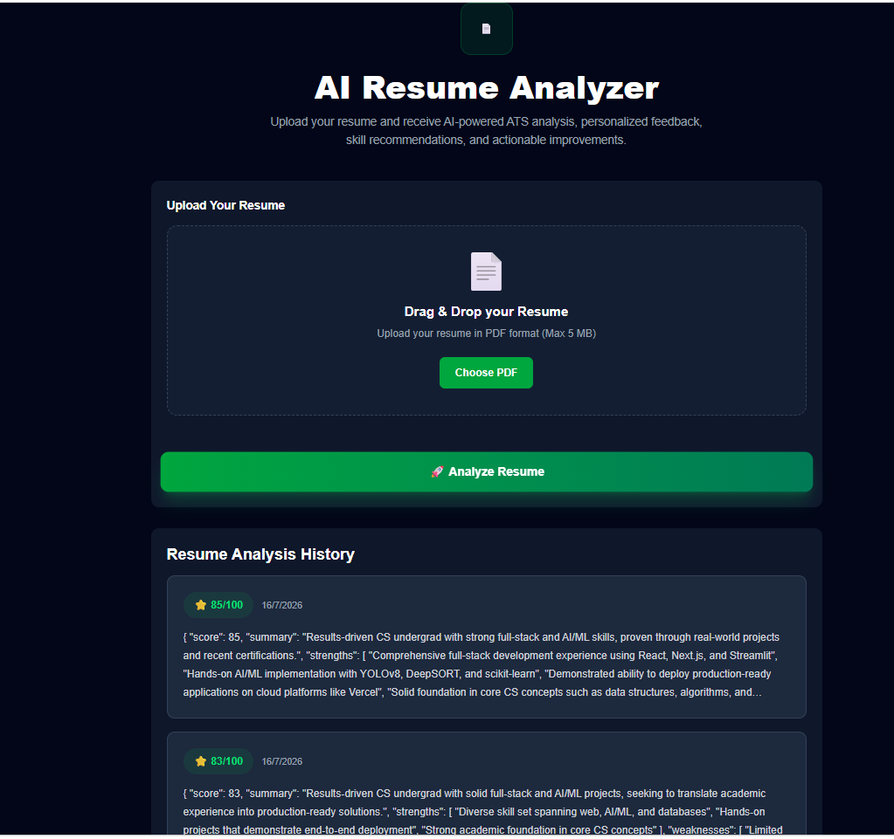
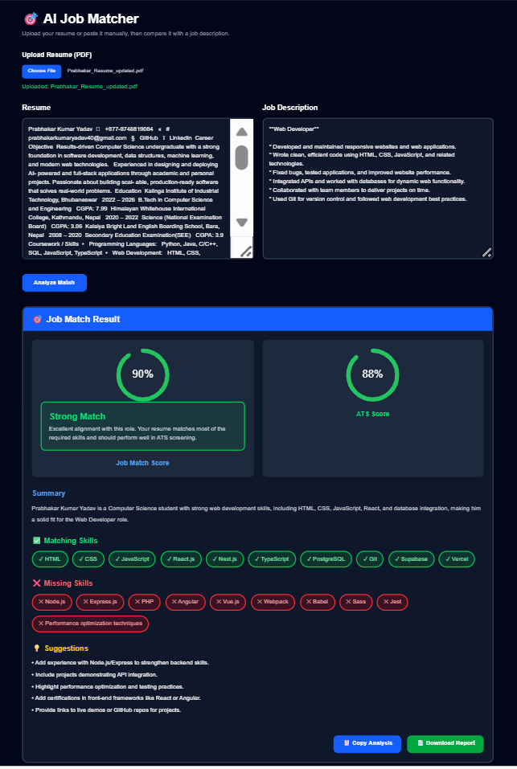
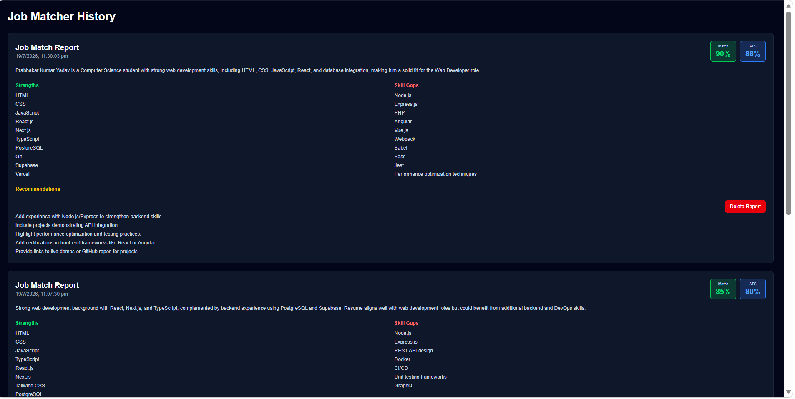
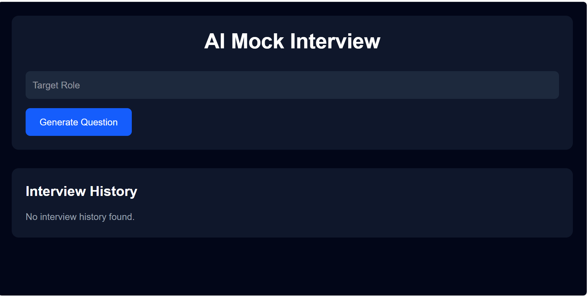
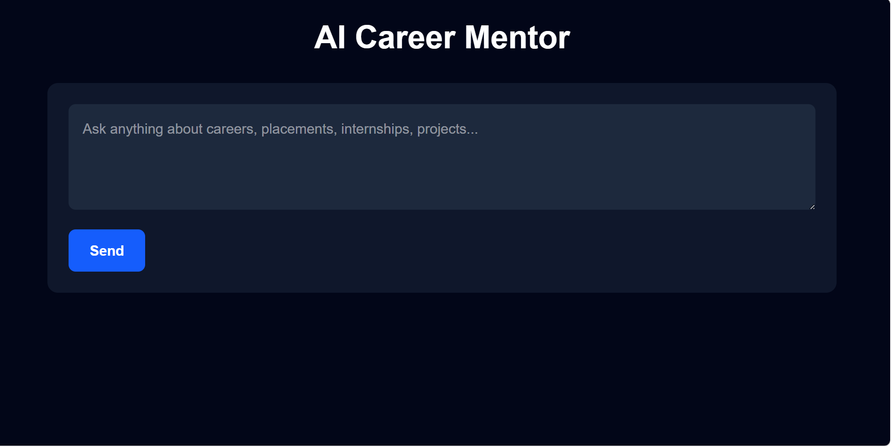
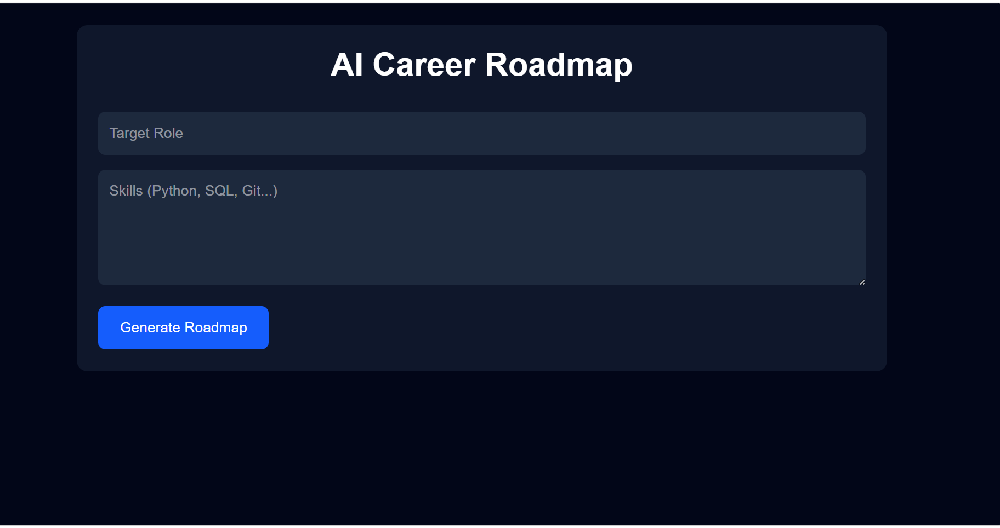
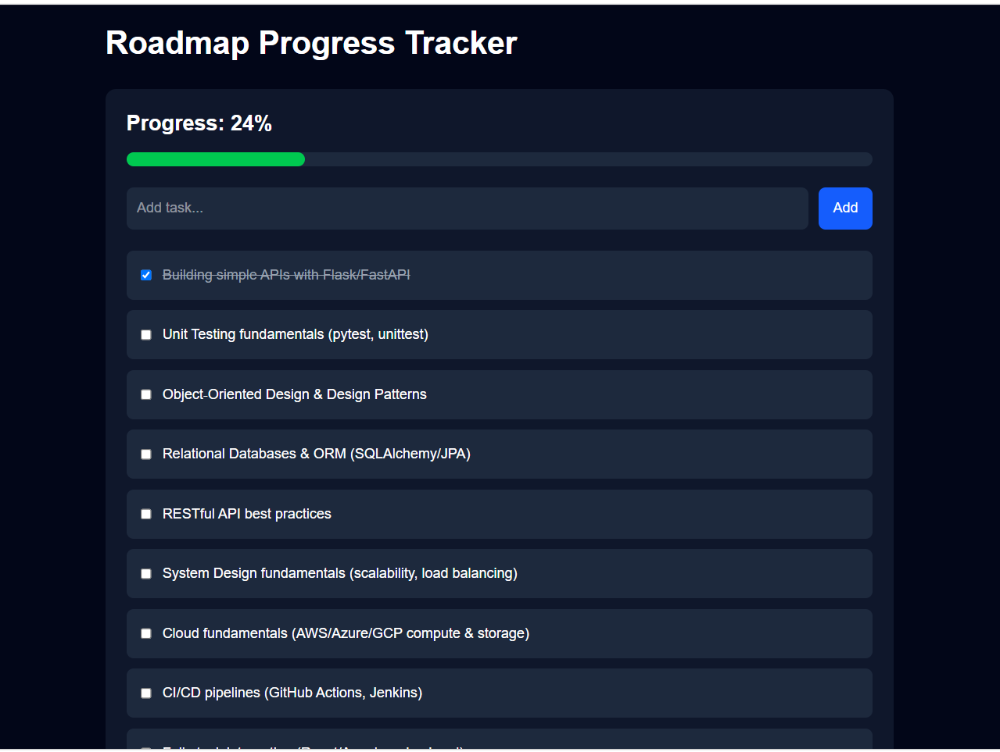
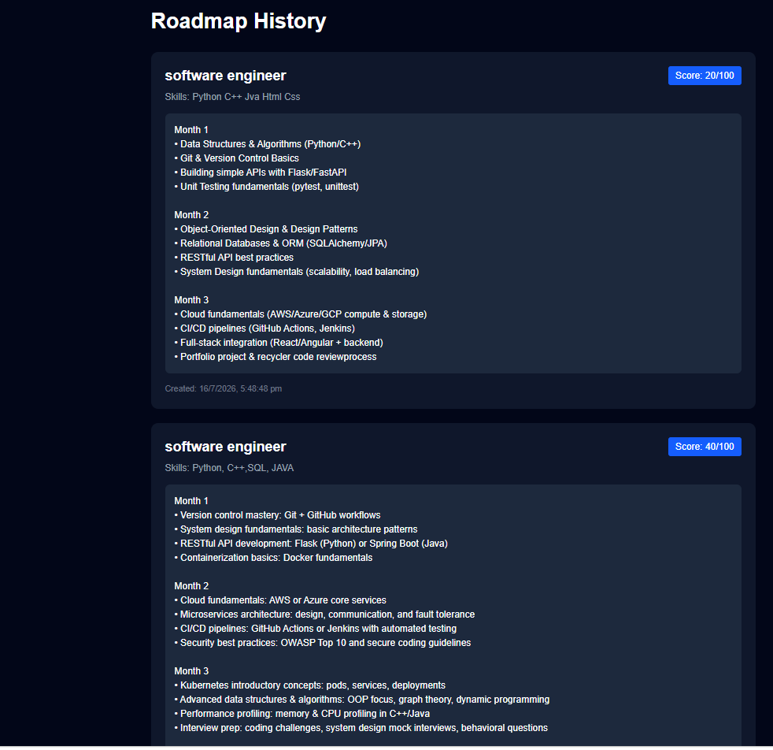

# 🚀 CareerForge AI

> An AI-powered career development platform that helps students and job seekers improve their resumes, prepare for interviews, match resumes with job descriptions, generate personalized learning roadmaps, and receive AI career guidance—all in one place.

🌐 **Live Demo:** https://career-forge-ai-eta.vercel.app

---

## 📌 Overview

CareerForge AI is a full-stack AI career assistant built using **Next.js, React, TypeScript, Supabase, PostgreSQL, and OpenAI API**.

The platform combines multiple AI-powered career tools into one application, allowing users to analyze resumes, compare them with job descriptions, generate personalized career roadmaps, practice interviews, and receive AI career guidance.

---

# ✨ Features

### 📄 AI Resume Analyzer
- Upload resume in PDF format
- AI-powered ATS analysis
- Resume score generation
- Strength & weakness detection
- Improvement suggestions
- Resume analysis history

---

### 🎯 AI Job Matcher
- Compare resume against any job description
- ATS compatibility score
- Job match percentage
- Missing skills detection
- Personalized recommendations
- Download analysis report as PDF

---

### 🛣 AI Career Roadmap Generator
- Personalized learning roadmap
- Generated based on target role
- Skill-based recommendations
- Month-wise learning plan
- Roadmap history

---

### 📈 Roadmap Progress Tracker
- Track learning progress
- Interactive task checklist
- Progress percentage
- Save learning journey

---

### 🎤 AI Mock Interview
- Generate interview questions
- Role-specific interview preparation
- Interview history

---

### 🤖 AI Career Mentor
- AI chatbot for career guidance
- Ask career-related questions
- Placement guidance
- Project recommendations
- Learning advice

---

### 👤 User Dashboard
- Resume score
- Career score
- Interview count
- Roadmap progress
- Quick access to all AI tools

---

### 🔐 Authentication
- User Registration
- Login
- Secure authentication
- Personalized dashboard

---

# 🖥 Screenshots

## Landing Page



---

## Dashboard



---

## Resume Analyzer



---

## AI Job Matcher



---

## Job Match History



---

## AI Mock Interview



---

## AI Career Mentor



---

## AI Roadmap Generator



---

## Progress Tracker



---

## Roadmap History



---

# 🛠 Tech Stack

## Frontend

- Next.js 16
- React 19
- TypeScript
- Tailwind CSS
- Framer Motion
- Recharts
- Lucide React

---

## Backend

- Next.js API Routes
- OpenAI API

---

## Database

- PostgreSQL
- Supabase

---

## Authentication

- Supabase Auth

---

## AI

- OpenAI GPT API

---

## PDF Processing

- pdfjs-dist
- react-pdftotext
- jsPDF
- jsPDF-AutoTable

---

# 📂 Project Structure

```
CareerForgeAI
│
├── backend
├── database
├── docs
├── frontend
│
├── app
│   ├── api
│   ├── dashboard
│   ├── login
│   ├── register
│   ├── resume
│   ├── roadmap
│   ├── interview
│   ├── chat
│   └── job-matcher
│
├── components
├── lib
├── public
└── package.json
```

---

# ⚙ Installation

Clone the repository

```bash
git clone https://github.com/prabhakarkumaryadav40-glitch/CareerForgeAI.git
```

Go into the project

```bash
cd CareerForgeAI/frontend
```

Install dependencies

```bash
npm install
```

## 🔑 Environment Variables

Create a `.env.local` file in the project root and add the following:

```env
OPENAI_API_KEY=your_openai_api_key

NEXT_PUBLIC_SUPABASE_URL=your_supabase_url
NEXT_PUBLIC_SUPABASE_ANON_KEY=your_supabase_anon_key

SUPABASE_SERVICE_ROLE_KEY=your_supabase_service_role_key
```

> **Important:** Never commit your `.env.local` file or expose your API keys publicly.

## ▶️ Run the Development Server

```bash
npm install
npm run dev
```

Open http://localhost:3000 in your browser.


```bash


---

# 📊 Main Modules

- Resume Analyzer
- ATS Checker
- AI Job Matcher
- Career Roadmap Generator
- Progress Tracker
- AI Interview Generator
- Career Mentor Chatbot
- Authentication
- Dashboard
- History Management

---

# 🚀 Future Improvements

- Voice Mock Interviews
- Resume Builder
- LinkedIn Profile Analyzer
- GitHub Profile Analysis
- Company-wise Interview Questions
- Skill Assessment Tests
- Email Notifications
- AI Career Recommendation Engine

---

# 👨‍💻 Developer

**Prabhakar Kumar Yadav**

LinkedIn

https://www.linkedin.com/in/prabhakar-kumar-yadav-675379359/

---

# ⭐ Support

If you like this project, consider giving it a ⭐ on GitHub.

It motivates me to build more AI-powered applications.